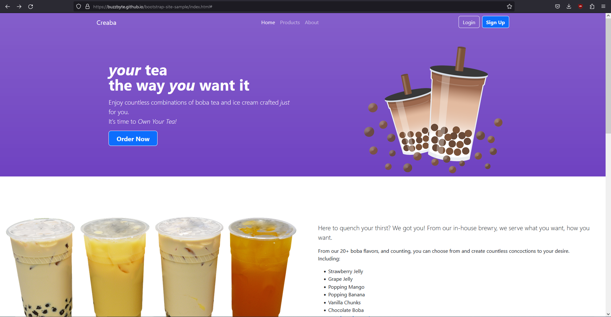
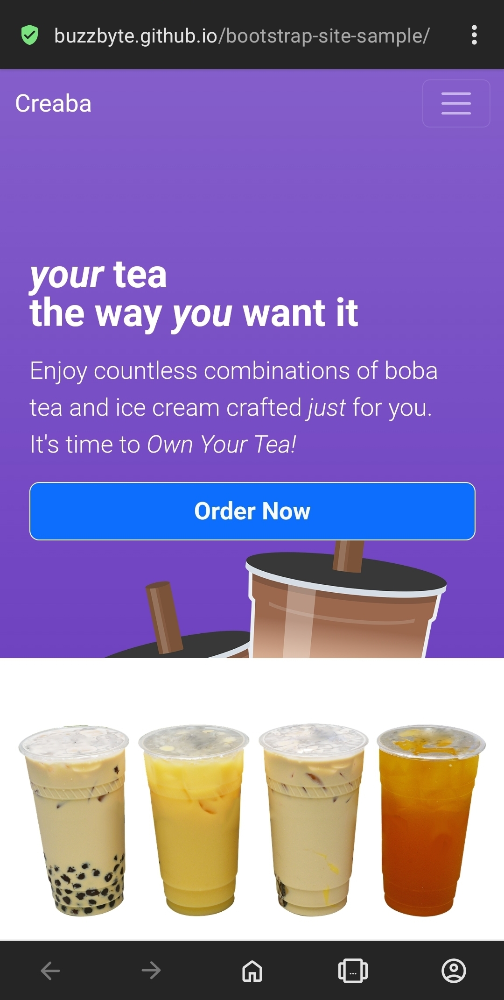
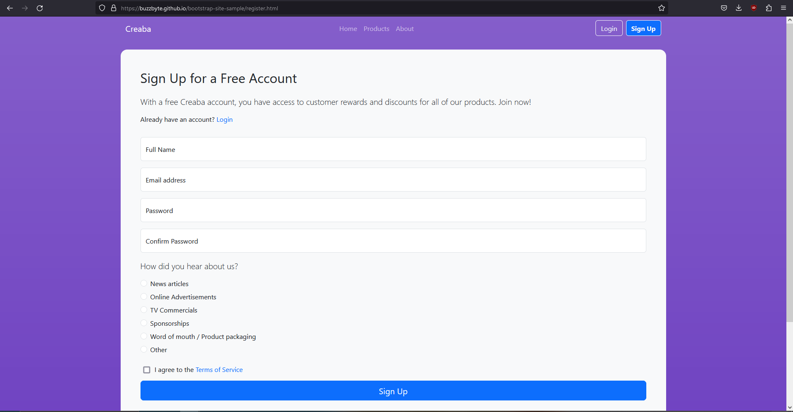
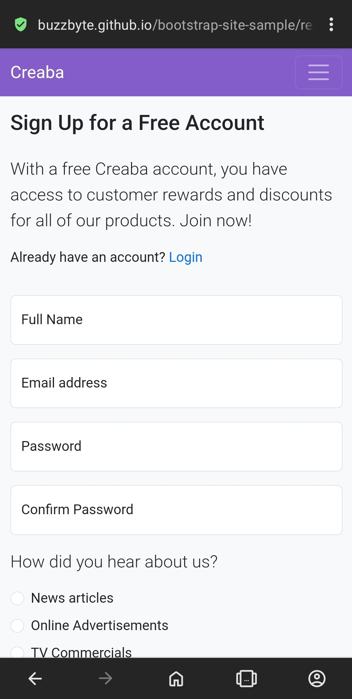
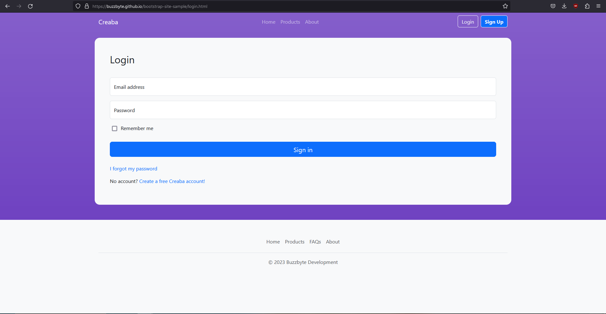
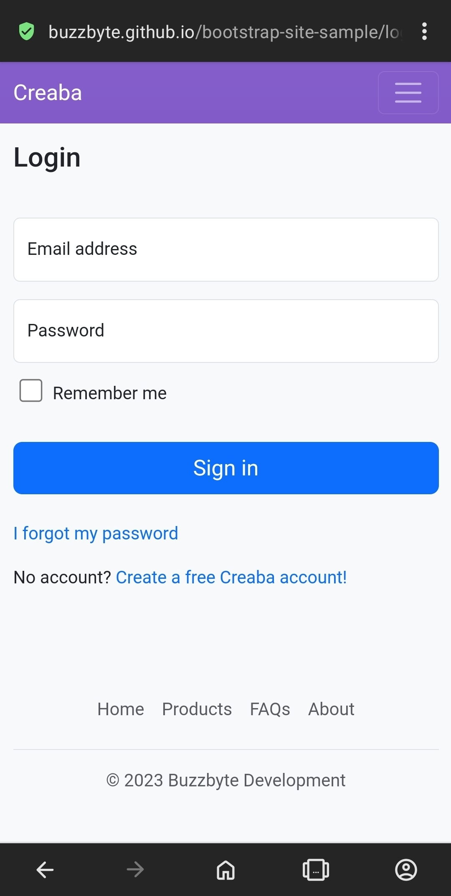
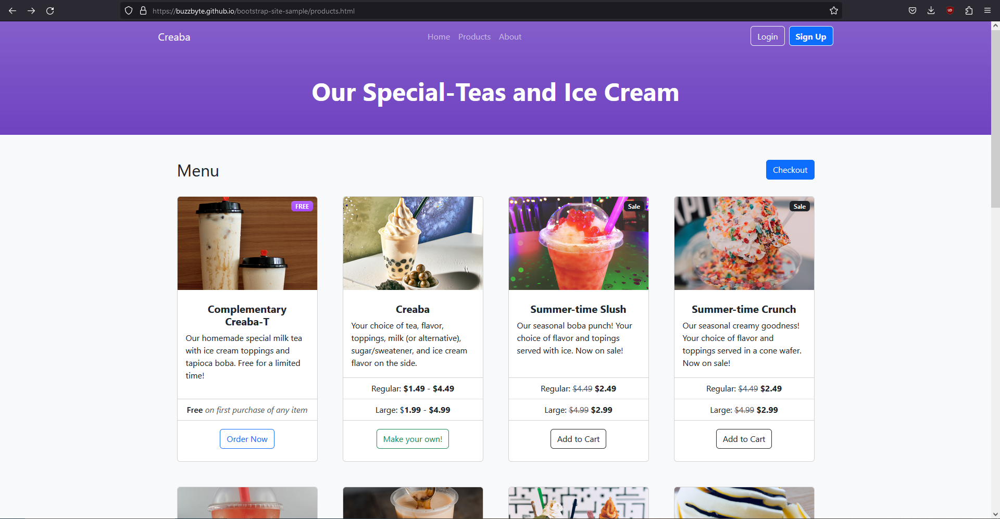
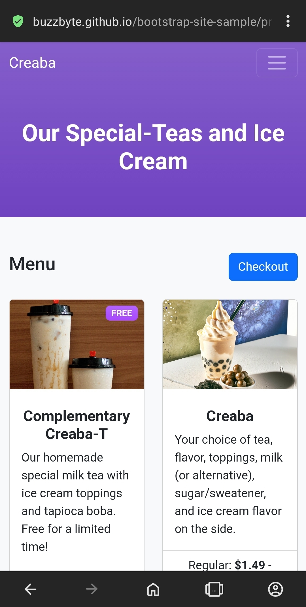
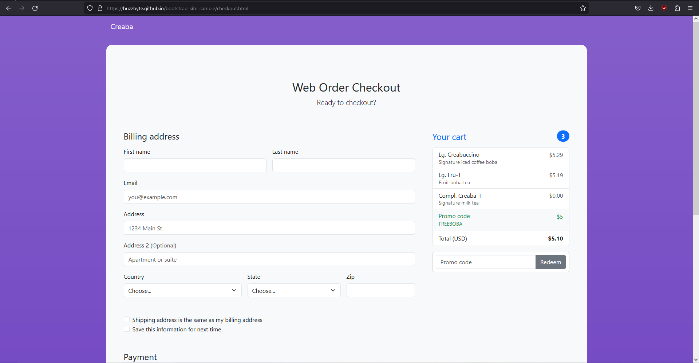
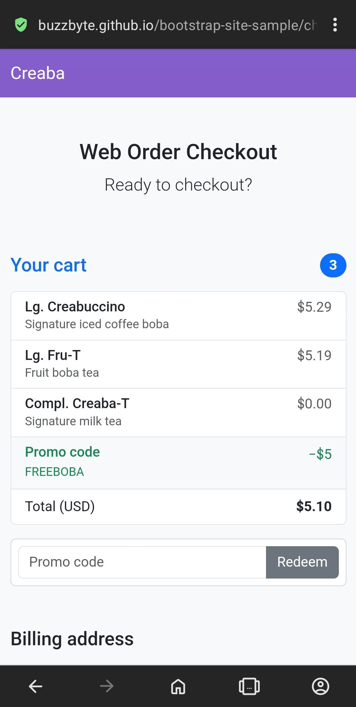

# Creaba - Bootstrap Sample Site
A simple Bootstrap-powered site made for Year Up's Learn To Code program.

Currently, this site only uses HTML and CSS. NPM is only used to download
bootstrap dependancies and spin up a convenient webserver to view the site.

Scroll down for the complete [site demonstration](#site-demo) with
screenshots included.

## Local Installation
This project makes use of NPM to install dependencies and simple web server,
but you can also manually download and copy them.

**Using pnpm** (preferred method)
```bash
pnpm install
pnpm build

# run webserver
pnpm start
```

**Using yarn**
```bash
yarn
yarn build

# run webserver
yarn start
```

**Using npm**
```bash
npm install
npm run build

# run webserver
npm start
```

### Manually
1. Download the latest [Bootstrap 5.3](http://getbootstrap.com)
2. Create a folder called `dist` in the working directory
3. Extract the bootstrap zip file into the `dist` folder you just created and rename it to just `bootstrap`
   * Make sure there are no double directories (path to bootstrap css should be `dist/bootstrap/css/bootstrap.min.css`)
4. Run a local webserver on the working directory and visit the site

## Site Demo
You can browse the site [here](https://buzzbyte.github.io/bootstrap-site-sample).

This website is an example of an E-Commerce site that sells customized build-your-own bubble (boba) tea and ice cream. It was made using bootstrap with an additional custom CSS stylesheet and features 5 different responsive pages outlined below:

### Home page
Includes header with navbar, footer, three images (along with a fancy background image that shows on scroll), 3 paragraphs with an unordered list, and an About Us section.

Desktop                                               | Mobile
:----------------------------------------------------:|:-------------------------------------------------:
 | 

### User Registeration
Includes name, email, password, password confirmation, "How did you hear about us" radio buttons, and button.

HTML for input validation is also present and uses bootstrap styling.

Desktop                                               | Mobile
:----------------------------------------------------:|:-------------------------------------------------:
 | 

### User Login
Includes email, password, remember me checkbox, and button. Also links to sign up.

HTML for input validation is also present and uses bootstrap styling.

Desktop                                               | Mobile
:----------------------------------------------------:|:-------------------------------------------------:
 | 

### Products
Includes 8+ items displayed using bootstrap's cards component. Each item card includes title, description, price, and order/cart button. The checkout page is accessible from here.

Also includes an extra section that lists the different flavors.

Desktop                                               | Mobile
:----------------------------------------------------:|:-------------------------------------------------:
 | 

### Checkout
Includes all nessecary feilds for checkout as well as a sample cart display.

HTML for input validation is also present and uses bootstrap styling.

Desktop                                               | Mobile
:----------------------------------------------------:|:-------------------------------------------------:
 | 